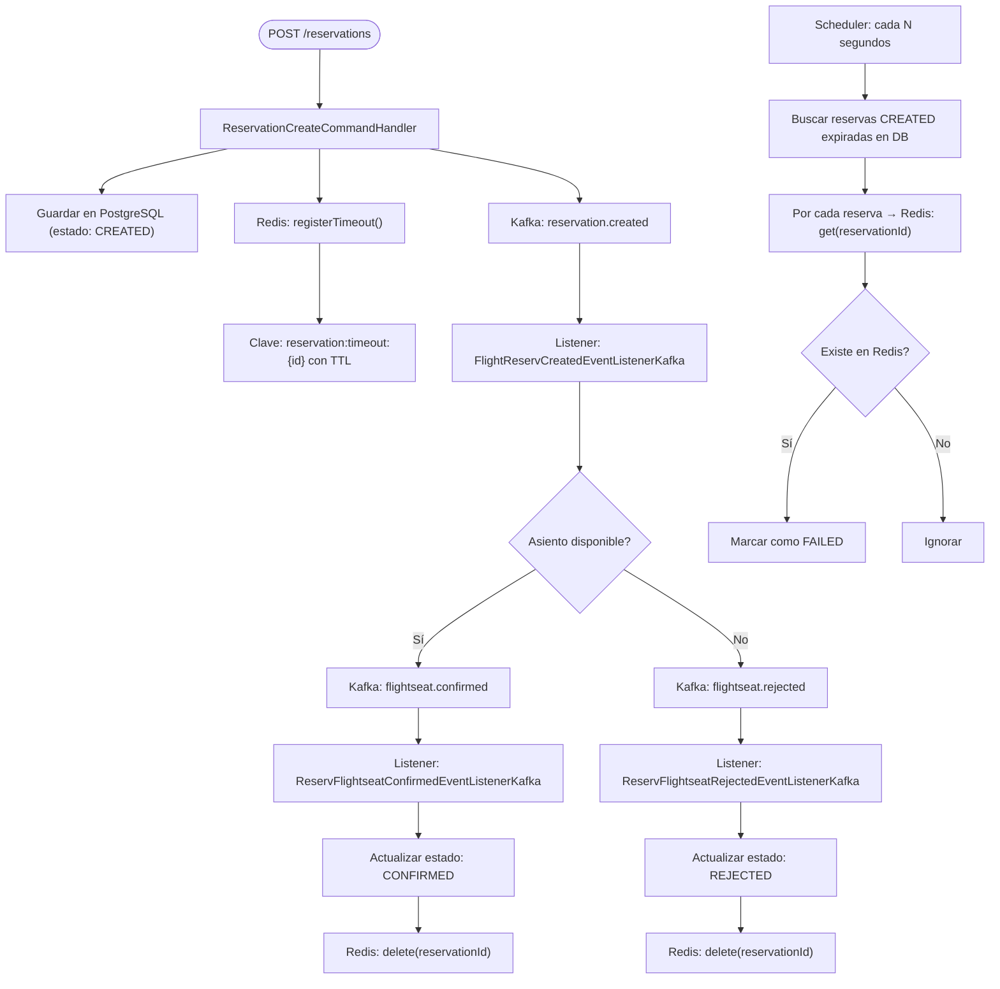

# Flight Booking Reactive System ✈️

## 🌟 Visión General
Este proyecto es una **prueba de concepto (POC)** para demostrar un sistema de reserva de vuelos utilizando una arquitectura basada en eventos, totalmente reactiva y distribuida. Aunque no representa un proceso completo en producción, **implementa las piezas clave del dominio**, como creación de reservas, verificación de disponibilidad de asientos, publicación de eventos asincrónicos y manejo de estados con persistencia reactiva.

Su propósito es **explorar cómo construir una solución moderna y desacoplada**, aplicando buenas prácticas arquitectónicas, patrones de diseño y tecnologías de última generación como **WebFlux, Reactor Core, Redis y Kafka**.

---

## ⚙️ Tecnologías Clave
- **Spring Boot 3.5 + WebFlux**
- **Project Reactor (Reactor Core)**
- **PostgreSQL (con R2DBC)**
- **Redis** para estado temporal y control de TTL
- **Kafka** para eventos distribuidos
- **Liquibase** con scripts en formato YAML para control de versiones de base de datos
- **Arquitectura Hexagonal (Ports & Adapters)**
- **Domain-Driven Design (DDD)**
- **Lombok**

---

## 🔍 Mejores Prácticas Aplicadas
- Eventos **versionados** y trazables (`traceId`)
- `IntegrationEventWrapper` como contrato de publicación
- No se usan eventos genéricos universales
- Dominios inmutables, controlados mediante **máquina de estados**
- Separación completa entre **infraestructura y lógica de negocio**
- **Value Objects** y entidades con responsabilidad encapsulada
- Separación entre `command`, `use case`, `controller`, `publisher`, `listener`


---

## 🧠 Enfoque Arquitectónico

### ✅ Arquitectura Hexagonal + DDD
Separación estricta entre:
- **Dominio puro:** lógica central sin dependencias externas
- **Aplicación:** casos de uso y orquestación
- **Infraestructura:** persistencia, colas, Redis, controladores

### 🧩 Event-Driven Architecture 

Cada evento tiene su propio:

- **Publisher**: encapsula la lógica de publicación, ahora implementado 100% con `KafkaSender` de **Reactor Kafka**, sin romper el flujo reactivo.
- **Listener**: desacopla y responde de forma no bloqueante con `KafkaReceiver`, evitando el uso de `@KafkaListener` imperativo.

Además:

- Se creó una **fábrica de KafkaSender y KafkaReceiver** (`KafkaSenderFactory`, `KafkaReceiverFactory`) que permite configurar dinamicamente productores y consumidores sin definir beans individuales por evento.
- La (de)serialización se maneja con clases reactivas (`ReactiveJsonEncoder`, `ReactiveJsonDecoder`), eliminando llamadas bloqueantes.
- Se evita el uso de `@PostConstruct` y se emplea `ApplicationReadyEvent` sólo donde estrictamente necesario, o se suscriben los `KafkaReceiver` directamente en cada clase.
- Todos los `Publisher` y `Listener` fueron refactorizados para usar `Mono<Void>` como contrato uniforme.

Cada evento tiene su propio:
- **Publisher:** encapsula lógica de publicación
- **Listener:** desacopla y responde de forma reactiva

Esto permite trazabilidad, resiliencia y mantenimiento independiente.

---

## 🐳 Instalación con Docker Compose

Este proyecto puede ejecutarse de forma completa con **Docker Compose** incluyendo sus dependencias como PostgreSQL, Redis y Kafka.

### 🔧 Requisitos

- Docker
- Docker Compose

### ▶️ Comandos para ejecutar

```bash
# Situarse dentro de la carpeta del proyecto y ejecutar
docker compose -p flightbooking up -d

# Una vez ejecutado el comando anterior, se puede verificar con
docker ps
```

### 🧪 Verificación

Una vez iniciado el entorno, accede a:

- API: [http://localhost:8095/api/flight](http://localhost:8095/api/flight)
- Swagger: [http://localhost:8095/swagger-ui.html](http://localhost:8095/swagger-ui.html)

---

## 📚 Documentación de la API (Swagger / OpenAPI)

Este proyecto expone una interfaz interactiva Swagger UI para consultar los endpoints disponibles.

- **Swagger UI**:  
  👉 [http://localhost:8095/swagger-ui.html](http://localhost:8095/swagger-ui.html)

- **OpenAPI YAML** (especificación de contrato):  
  👉 [http://localhost:8095/v3/api-docs.yaml](http://localhost:8095/v3/api-docs.yaml)

La documentación se genera automáticamente gracias a la integración con `springdoc-openapi` y se actualiza con base en los controladores REST definidos.

## 🔗 Endpoints REST Disponibles

| Método | URL                         | Descripción                         |
|--------|-----------------------------|-------------------------------------|
| POST   | `/api/flight`               | Crea un nuevo vuelo                 |
| GET    | `/api/flight`               | Lista todos los vuelos              |
| POST   | `/api/reservation`          | Crea una nueva reserva              |
| GET    | `/api/reservation`          | Lista todas las reservas            |
| POST   | `/api/ticket/checkin`       | Realiza el check-in de un ticket    |

> Todos los endpoints devuelven respuestas en formato `application/json` y siguen el estilo RESTful.

---

## 🧩 Diagrama de flujo



## Consideraciones

### 🧠 Uso de Redis
Redis se utiliza como:
- **Repositorio distribuido temporal** para validaciones por evento
- Con **TTL configurado**, se garantiza la expiración automática si la reserva no es confirmada
- Se implementa un patrón **de agregación reactiva temporal distribuida**

### 🎫 Flujo de Emisión de Ticket y Check-In (NUEVO)
- Cuando una reserva es confirmada (`ReservationConfirmedEvent`), se crea automáticamente un **Ticket** con su estado inicial.
- El usuario puede realizar **Check-in**, el cual es validado internamente por el estado del `Ticket`.
- Todo esto se implementa mediante casos de uso reactivos, eventos asincrónicos y un **modelo de dominio rico** basado en máquina de estados.

### ⚡ Flujo 100% Asíncrono y No Bloqueante
Gracias al uso combinado de WebFlux + Reactor Core:
- No hay bloqueo de hilos
- Se aprovechan eficientemente los recursos
- La lógica se suscribe correctamente en todos los puntos críticos (`subscribe()` ubicado solo donde se requiere)

## 🛫 Flujo de Reserva de Vuelo
1. El usuario **crea una reserva** → `ReservationCreatedEvent`
2. Se verifica la disponibilidad de asientos → `FlightSeatConfirmed` o `FlightSeatRejected`
3. Se actualiza el estado de la reserva
4. Si no hay respuesta a tiempo → Redis marca como `FAILED`
5. Si se confirma la reserva → se crea automáticamente un **Ticket**
6. El usuario puede luego hacer **Check-in**

---

## 🗂️ Estructura de Proyecto: Arquitectura Hexagonal

```
src/main/java/com/aug/flightbooking
├── FlightBookingApplication.java                     # Clase principal que arranca la app Spring Boot
│
├── application                                        # Lógica de aplicación (casos de uso)
│   ├── command
│   │   ├── CreateCheckInCommand.java                 # Comando para realizar check-in
│   │   ├── CreateFlightCommand.java                  # Comando para crear un vuelo
│   │   └── CreateReservationCommand.java             # Comando para crear una reserva
│   │
│   ├── events
│   │   ├── FlightseatConfirmedEvent.java             # Evento: asiento confirmado
│   │   ├── FlightseatRejectedEvent.java              # Evento: asiento rechazado
│   │   ├── ReservationConfirmedEvent.java            # Evento: reserva confirmada
│   │   ├── ReservationCreatedEvent.java              # Evento: reserva creada
│   │   ├── ReservationFailedEvent.java               # Evento: reserva fallida
│   │   └── IntegrationEvent.java                     # Interfaz base para todos los eventos
│   │
│   ├── ports
│   │   ├── in
│   │   │   ├── CheckInTicketUseCase.java             # Caso de uso: check-in de ticket
│   │   │   ├── CreateFlightUseCase.java              # Caso de uso: creación de vuelo
│   │   │   ├── CreateReservationUseCase.java         # Caso de uso: creación de reserva
│   │   │   ├── FailReservationUseCase.java           # Caso de uso: marcar reserva como fallida
│   │   │   ├── FlightseatConfirmedEventHandler.java  # Manejador: evento asiento confirmado
│   │   │   ├── FlightseatRejectedEventHandler.java   # Manejador: evento asiento rechazado
│   │   │   └── ReservationCreatedEventHandler.java   # Manejador: evento reserva creada
│   │   │
│   │   └── out
│   │       ├── FlightRepository.java                 # Abstracción repositorio de vuelos
│   │       ├── ReservationRepository.java            # Abstracción repositorio de reservas
│   │       ├── TicketRepository.java                 # Abstracción repositorio de tickets
│   │       ├── ReservationCache.java                 # Abstracción de caché de reservas
│   │       ├── FlightseatConfirmedEventPublisher.java # Publisher: evento asiento confirmado
│   │       ├── FlightseatRejectedEventPublisher.java  # Publisher: evento asiento rechazado
│   │       ├── ReservationConfirmedEventPublisher.java # Publisher: evento reserva confirmada
│   │       └── ReservationCreatedEventPublisher.java   # Publisher: evento reserva creada
│   │
│   ├── result
│   │   └── ReservationResult.java                    # Resultado de proceso de reserva
│   │
│   └── service
│       ├── CheckInTicketService.java                 # Servicio: check-in de tickets
│       ├── CreateFlightService.java                  # Servicio: creación de vuelos
│       ├── CreateReservationService.java             # Servicio: creación de reservas
│       ├── FailReservationService.java               # Servicio: marca reserva como fallida
│       ├── FlightseatConfirmedEventHandlerService.java # Manejador evento: asiento confirmado
│       ├── FlightseatRejectedEventHandlerService.java  # Manejador evento: asiento rechazado
│       └── ReservationCreatedEventHandlerService.java  # Manejador evento: reserva creada
│
├── domain
│   ├── model
│   │   ├── Airline.java                              # Entidad: Aerolínea
│   │   ├── Flight.java                               # Entidad: Vuelo
│   │   ├── FlightStatus.java                         # Enum: estado del vuelo
│   │   ├── PassengerInfo.java                        # Value Object: info pasajero
│   │   ├── Reservation.java                          # Entidad: Reserva
│   │   ├── ReservationStateMachine.java              # Máquina de estados de reserva
│   │   ├── ReservationStatus.java                    # Enum: estado de reserva
│   │   ├── ReservationStatusAction.java              # Enum: acción según estado
│   │   ├── Ticket.java                               # Entidad: Ticket
│   │   └── TicketStatus.java                         # Enum: estado de ticket
│   │
│   └── exception
│       └── ReservationChangeStatusException.java     # Excepción cambio inválido de estado
│
├── infrastructure
│   ├── cache
│   │   ├── RedisReservationCache.java                # Implementación Redis del caché
│   │   └── ReservationTimeoutScheduler.java          # Scheduler para timeout de reservas
│   │
│   ├── config
│   │   ├── AppProperties.java                        # Propiedades cargadas desde config
│   │   ├── JdbcDataSourceConfig.java                 # Configuración para PostgreSQL R2DBC
│   │   ├── KafkaReceiverFactory.java                 # Factory para listeners Kafka
│   │   ├── KafkaSenderFactory.java                   # Factory para productores Kafka
│   │   └── RedisConfig.java                          # Configuración cliente Redis
│   │
│   ├── init
│   │   ├── AppStartupFinalListener.java              # Listener de arranque para iniciar listeners
│   │   ├── FlightDataInitializer.java                # Inicializador de datos de vuelos
│   │   └── ReservationDataInitializer.java           # Inicializador de datos de reservas
│   │
│   ├── messaging
│   │   ├── IntegrationEventWrapper.java              # Envoltura común para eventos
│   │   ├── listener
│   │   │   ├── FlightReservCreatedEventListenerKafka.java    # Listener reserva creada
│   │   │   ├── ReactiveListenersOrchestrator.java             # Orquestador de listeners Kafka
│   │   │   ├── ReservFlightseatConfirmedEventListenerKafka.java # Listener asiento confirmado
│   │   │   └── ReservFlightseatRejectedEventListenerKafka.java  # Listener asiento rechazado
│   │   │
│   │   ├── publisher
│   │   │   ├── FlightseatConfirmedEventPublisherKafka.java    # Publisher Kafka asiento confirmado
│   │   │   ├── FlightseatRejectedEventPublisherKafka.java     # Publisher Kafka asiento rechazado
│   │   │   ├── ReservationConfirmedEventPublisherKafka.java   # Publisher Kafka reserva confirmada
│   │   │   └── ReservationCreatedEventPublisherKafka.java     # Publisher Kafka reserva creada
│   │   │
│   │   └── serialization
│   │       ├── ReactiveJsonDecoder.java              # Decoder JSON no bloqueante
│   │       └── ReactiveJsonEncoder.java              # Encoder JSON no bloqueante
│   │
│   ├── repository
│   │   ├── adapter
│   │   │   ├── FlightRepositoryAdapter.java          # Adaptador repositorio vuelo
│   │   │   ├── ReservationRepositoryAdapter.java     # Adaptador repositorio reserva
│   │   │   └── TicketRepositoryAdapter.java          # Adaptador repositorio ticket
│   │   │
│   │   ├── entity
│   │   │   ├── FlightEntity.java                     # Entidad JPA persistente: vuelo
│   │   │   ├── ReservationEntity.java                # Entidad JPA persistente: reserva
│   │   │   └── TicketEntity.java                     # Entidad JPA persistente: ticket
│   │   │
│   │   ├── mapper
│   │   │   ├── FlightMapper.java                     # Mapper vuelo: entidad ↔ dominio
│   │   │   ├── ReservationMapper.java                # Mapper reserva: entidad ↔ dominio
│   │   │   └── TicketPersistenceMapper.java          # Mapper ticket: entidad ↔ dominio
│   │   │
│   │   └── r2dbc
│   │       ├── R2dbcFlightRepository.java            # Repositorio R2DBC vuelo
│   │       ├── R2dbcReservationRepository.java       # Repositorio R2DBC reserva
│   │       └── R2dbcTicketRepository.java            # Repositorio R2DBC ticket
│   │
│   └── web
│       ├── controller
│       │   ├── FlightController.java                 # Controlador REST para vuelos
│       │   ├── ReservationController.java            # Controlador REST para reservas
│       │   └── TicketCheckInController.java          # Controlador REST para check-in
│       │
│       ├── dto
│       │   ├── CheckInRequest.java                   # DTO entrada para check-in
│       │   ├── FlightCreateRequest.java              # DTO entrada para creación de vuelo
│       │   ├── FlightCreateResponse.java             # DTO salida tras crear vuelo
│       │   ├── ReservationRequest.java               # DTO entrada para reserva
│       │   └── ReservationResponse.java              # DTO salida para reserva
│       │
│       └── mapper
│           ├── CheckInCreateMapper.java             # Mapper entre DTO y dominio para check-in
│           ├── FlightCreateMapper.java              # Mapper entre DTO y dominio para vuelo
│           └── ReservationCreateMapper.java         # Mapper entre DTO y dominio para reserva

```

---


## ✅ Conclusión
Este proyecto representa un ejemplo moderno, modular y realista de cómo abordar sistemas distribuidos reactivos en Java. Es ideal para estudios de arquitectura avanzada, diseño de eventos, y adopción de WebFlux en entornos exigentes.

